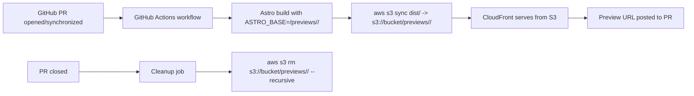

# Branch-Based Preview Architecture (Astro + Single S3 Bucket)

## 1. Objective

Create automatic preview environments for every PR/branch using:

- One S3 bucket
- One CloudFront distribution
- Astro static builds
- GitHub Actions deploy + cleanup automation

Target outcome:

- New/updated PR => preview URL live in minutes
- PR closed => preview files removed automatically
- No per-branch buckets or manual deploy work

## 2. Decision Summary

Primary pattern (recommended): **path-based previews**

- URL: `https://preview.example.com/previews/<preview-id>/`
- S3 prefix: `s3://<bucket>/previews/<preview-id>/`
- Lowest complexity, easiest to secure, easiest to debug

Optional UX upgrade: **branch subdomains on top of same bucket**

- URL: `https://<preview-id>.preview.example.com/`
- CloudFront Function maps host -> `/previews/<preview-id>/...`
- Same S3 bucket, same artifacts, nicer URLs

## 3. High-Level Architecture



## 4. Prerequisites

## AWS

- Existing S3 bucket for static hosting content
- Existing CloudFront distribution with bucket origin
- Route53/DNS record to CloudFront (`preview.example.com`)
- ACM certificate in `us-east-1` attached to CloudFront

## GitHub

- Actions enabled
- OIDC trust configured from GitHub -> AWS IAM role
- Repo variables:
  - `AWS_REGION`
  - `S3_BUCKET`
  - `CLOUDFRONT_DISTRIBUTION_ID`
  - `PREVIEW_BASE_URL` (example: `https://preview.example.com`)

## Astro

- Project builds to `dist/`
- `base` configurable via env var

## 5. Astro Configuration

`astro.config.mjs`:

```js
import { defineConfig } from "astro/config";

export default defineConfig({
  base: process.env.ASTRO_BASE ?? "/",
});
```

Rules:

- For previews set `ASTRO_BASE=/previews/<preview-id>/`
- Always include trailing slash for base paths
- Ensure internal links use Astro helpers (`import.meta.env.BASE_URL`, relative routes) rather than hardcoded `/`

## 6. Preview ID Convention

Use stable, collision-safe preview IDs:

- Format: `pr-<number>-<branch-slug>`
- Example: `pr-142-fix-navbar-overflow`

Generation rules:

- Lowercase
- Replace non-alphanumeric with `-`
- Trim edge dashes
- Max length (example 63 chars)

Why include PR number:

- Branch rename safe
- Duplicate branch names across forks less risky
- Easy traceability in S3

## 7. S3 Object Layout

```txt
s3://<bucket>/
  index.html                  # optional prod root content
  assets/...                  # optional prod root assets
  previews/
    pr-142-fix-navbar-overflow/
      index.html
      about/index.html
      _astro/*.js
    pr-143-search-refactor/
      ...
```

## 8. GitHub Actions Workflow

Create `.github/workflows/preview.yml`.

Core behavior:

- On PR opened/synchronize/reopened:
  - Build Astro with preview base
  - Sync dist to preview prefix
  - Invalidate preview path on CloudFront
  - Comment/update PR with preview URL
- On PR closed:
  - Remove preview prefix
  - Invalidate preview path

Reference workflow:

```yaml
name: Preview Deploy

on:
  pull_request:
    types: [opened, synchronize, reopened, closed]

permissions:
  id-token: write
  contents: read
  pull-requests: write

concurrency:
  group: preview-${{ github.event.pull_request.number }}
  cancel-in-progress: true

env:
  AWS_REGION: ${{ vars.AWS_REGION }}
  S3_BUCKET: ${{ vars.S3_BUCKET }}
  DISTRIBUTION_ID: ${{ vars.CLOUDFRONT_DISTRIBUTION_ID }}
  PREVIEW_BASE_URL: ${{ vars.PREVIEW_BASE_URL }}

jobs:
  deploy-preview:
    if: github.event.action != 'closed' && github.event.pull_request.head.repo.full_name == github.repository
    runs-on: ubuntu-latest
    steps:
      - uses: actions/checkout@v4

      - name: Compute preview id
        id: preview
        shell: bash
        run: |
          BRANCH="${{ github.head_ref }}"
          SLUG="$(echo "$BRANCH" | tr '[:upper:]' '[:lower:]' | sed -E 's/[^a-z0-9]+/-/g; s/^-+|-+$//g' | cut -c1-40)"
          PREVIEW_ID="pr-${{ github.event.pull_request.number }}-$SLUG"
          echo "preview_id=$PREVIEW_ID" >> "$GITHUB_OUTPUT"
          echo "preview_path=previews/$PREVIEW_ID" >> "$GITHUB_OUTPUT"
          echo "preview_url=${PREVIEW_BASE_URL}/previews/$PREVIEW_ID/" >> "$GITHUB_OUTPUT"

      - name: Configure AWS credentials (OIDC)
        uses: aws-actions/configure-aws-credentials@v4
        with:
          role-to-assume: arn:aws:iam::<account-id>:role/github-preview-deployer
          aws-region: ${{ env.AWS_REGION }}

      - uses: actions/setup-node@v4
        with:
          node-version: 20
          cache: npm

      - run: npm ci

      - name: Build Astro
        env:
          ASTRO_BASE: /${{ steps.preview.outputs.preview_path }}/
        run: npm run build

      - name: Sync preview files
        run: |
          aws s3 sync dist/ "s3://${S3_BUCKET}/${{ steps.preview.outputs.preview_path }}/" --delete

      - name: Invalidate preview path
        run: |
          aws cloudfront create-invalidation \
            --distribution-id "${DISTRIBUTION_ID}" \
            --paths "/${{ steps.preview.outputs.preview_path }}/*"

      - name: Comment preview URL
        uses: actions/github-script@v7
        with:
          script: |
            const body = `Preview: ${{ steps.preview.outputs.preview_url }}`;
            const marker = "<!-- preview-url-comment -->";
            const nextBody = `${marker}\n${body}`;
            const {owner, repo} = context.repo;
            const issue_number = context.issue.number;
            const comments = await github.rest.issues.listComments({owner, repo, issue_number});
            const existing = comments.data.find(c => c.body?.includes(marker));
            if (existing) {
              await github.rest.issues.updateComment({owner, repo, comment_id: existing.id, body: nextBody});
            } else {
              await github.rest.issues.createComment({owner, repo, issue_number, body: nextBody});
            }

  cleanup-preview:
    if: github.event.action == 'closed' && github.event.pull_request.head.repo.full_name == github.repository
    runs-on: ubuntu-latest
    steps:
      - name: Compute preview id
        id: preview
        shell: bash
        run: |
          BRANCH="${{ github.head_ref }}"
          SLUG="$(echo "$BRANCH" | tr '[:upper:]' '[:lower:]' | sed -E 's/[^a-z0-9]+/-/g; s/^-+|-+$//g' | cut -c1-40)"
          PREVIEW_ID="pr-${{ github.event.pull_request.number }}-$SLUG"
          echo "preview_path=previews/$PREVIEW_ID" >> "$GITHUB_OUTPUT"

      - name: Configure AWS credentials (OIDC)
        uses: aws-actions/configure-aws-credentials@v4
        with:
          role-to-assume: arn:aws:iam::<account-id>:role/github-preview-deployer
          aws-region: ${{ env.AWS_REGION }}

      - name: Delete preview files
        run: |
          aws s3 rm "s3://${S3_BUCKET}/${{ steps.preview.outputs.preview_path }}/" --recursive

      - name: Invalidate preview path
        run: |
          aws cloudfront create-invalidation \
            --distribution-id "${DISTRIBUTION_ID}" \
            --paths "/${{ steps.preview.outputs.preview_path }}/*"
```

## 9. IAM: Minimum Permissions

Role used by GitHub workflow:

- `s3:PutObject`
- `s3:GetObject`
- `s3:DeleteObject`
- `s3:ListBucket` (scoped to `previews/*` conditions where possible)
- `cloudfront:CreateInvalidation` for one distribution

Trust policy:

- Federated principal: GitHub OIDC provider
- Restrict `sub` to your repository
- Restrict branch/event patterns as needed

Security note:

- Keep preview deploy disabled for fork PRs unless explicitly designed for it.
- Current workflow guard does this with:
  - `github.event.pull_request.head.repo.full_name == github.repository`

## 10. CloudFront Routing Details

Path-based only:

- No extra function required if URLs include trailing `/`
- Optionally add rewrite function for cleaner handling of extensionless URLs

Optional subdomain-based previews:

- Add wildcard alias: `*.preview.example.com`
- Add wildcard DNS CNAME/ALIAS to CloudFront
- Add CloudFront Function (viewer-request) to map host to prefix

Example function:

```js
function handler(event) {
  var request = event.request;
  var host = request.headers.host.value.toLowerCase();
  var suffix = ".preview.example.com";

  if (host.endsWith(suffix)) {
    var id = host.slice(0, host.length - suffix.length);
    if (id && !id.includes(".")) {
      request.uri = "/previews/" + id + request.uri;
    }
  }

  if (request.uri.endsWith("/")) {
    request.uri += "index.html";
  } else if (!request.uri.includes(".")) {
    request.uri += "/index.html";
  }

  return request;
}
```

## 11. Cache Strategy

Simple starting point:

- Upload all files with default metadata
- Invalidate `/previews/<id>/*` after each deploy

Optimized variant:

- HTML files: short TTL / no-cache
- Hashed assets (`_astro/*`): long TTL immutable
- Fewer invalidations required

## 12. Lifecycle + Cost Control

Add S3 lifecycle rule:

- Prefix: `previews/`
- Expire objects after 14-30 days

This cleans abandoned previews (failed cleanup, unusual PR states).

## 13. Failure Modes + Mitigations

1. Preview URL 404

- Check ASTRO_BASE uses exact preview path with trailing `/`
- Check S3 prefix content exists
- Check CloudFront invalidation completed

2. Broken asset links

- Usually wrong `base` config
- Verify built HTML points to `/previews/<id>/_astro/...`

3. Fork PR security concerns

- Skip deploy for forks or run an isolated low-privilege flow

4. Stale content after redeploy

- Ensure `aws s3 sync --delete`
- Ensure invalidation path includes `/*`

## 14. Implementation Checklist (for Agent)

1. Update Astro config for env-driven `base`.
2. Add workflow `.github/workflows/preview.yml`.
3. Create/verify IAM OIDC role and permission scope.
4. Add GitHub repo variables (`AWS_REGION`, `S3_BUCKET`, `CLOUDFRONT_DISTRIBUTION_ID`, `PREVIEW_BASE_URL`).
5. Test PR open:
   - Workflow succeeds
   - Preview URL comment appears
   - Root + nested route load
6. Test PR update:
   - Previous files removed (`--delete`)
   - URL remains stable
7. Test PR close:
   - S3 prefix removed
   - URL no longer serves content
8. Add lifecycle rule for `previews/`.
9. Optional: add subdomain mapping function + wildcard DNS.

## 15. Validation Commands

```bash
# list preview prefixes
aws s3 ls s3://<bucket>/previews/

# inspect one preview
aws s3 ls s3://<bucket>/previews/<preview-id>/ --recursive | head

# manual cleanup (if needed)
aws s3 rm s3://<bucket>/previews/<preview-id>/ --recursive

# create invalidation
aws cloudfront create-invalidation \
  --distribution-id <distribution-id> \
  --paths "/previews/<preview-id>/*"
```

## 16. Recommended Rollout Plan

Phase 1:

- Path-based previews only
- PR deploy + close cleanup
- Manual verification for 2-3 PRs

Phase 2:

- Add lifecycle policy
- Improve caching headers

Phase 3 (optional):

- Wildcard per-branch subdomain URLs via CloudFront Function

